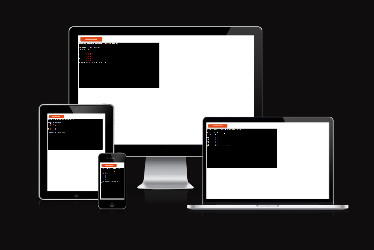

Welcome to Battleship

Battleship is a python terminal game , which runs in heroku

Users can must find the ships of the computer before the computer finds them.

this is the live version of my project <a href="https://python-project-battleship.herokuapp.com/" target="_blank" rel="noopener">Battleship</a>

## How to play

Ultimate Battleships is based on the classic pen-and-paper game.
in this version the player must find the hidden ship of the computer.

* Your code must be placed in the `run.py` file
* Your dependencies must be placed in the `requirements.txt` file
* Do not edit any of the other files or your code may not deploy properly

## Creating the Heroku app

When you create the app, you will need to add two buildpacks from the _Settings_ tab. The ordering is as follows:

1. `heroku/python`
2. `heroku/nodejs`

You must then create a _Config Var_ called `PORT`. Set this to `8000`

If you have credentials, such as in the Love Sandwiches project, you must create another _Config Var_ called `CREDS` and paste the JSON into the value field.

Connect your GitHub repository and deploy as normal.

## Constraints

The deployment terminal is set to 80 columns by 24 rows. That means that each line of text needs to be 80 characters or less otherwise it will be wrapped onto a second line.

-----
Happy coding!