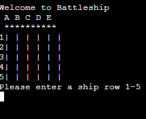
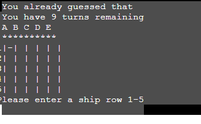

Welcome to Battleship

Battleship is a python terminal game , which runs in heroku

Users can must find the ships of the computer before the computer finds them.

this is the live version of my project <a href="https://python-project-battleship.herokuapp.com/" target="_blank" rel="noopener">Battleship</a>

## How to play

Ultimate Battleships is based on the classic pen-and-paper game.
in this version the player must find the hidden ship of the computer.
if the player hits a ship its indicated by 'x' and it misses is indicated by '-'
The winner is the player who sinks all of their opponent's ships first.

## features 

## Existing Feature

* random board
    * ships are randomly placed in the boards
    * the player cannot see where the computer ships are
    
    * play againes the computer
    * accepts user input
    * it has 10 term for the challeng
* input validation
    * you cannot enter coordinates outside the size of the grid 
    * you cannot enter the same guess twice
    

## Testing

i have manually tested the project by doing the following :
    * passed the code in pep8 inter and confrim no problems
    * checked with invalid input 
    * tested in heroku terminal
    

## Bugs 

the must bug was the input method so i had to change it to know the first number is '1' not '0'

## Deployment 

This project was deployed using the code institute mock terminal for heroku
    * clone the project in github
    * create a new heroku app
    * set the buildback to python and node.js in order 
    * link the heroku to the repository
    * click on Deploy

# credits
* code institute for the deployment terminal
* searching in google for helps

# Acknowledgements
The site was completed as a Portfolio 3 Project piece for the Full Stack Software Developer (e-Commerce) Diploma at the [Code Institute](https://codeinstitute.net/). As such I would like to thank my mentor [Precious Ijege](https://www.linkedin.com/in/precious-ijege-908a00168/), the Slack community, and all at the Code Institute for their help and support. 
